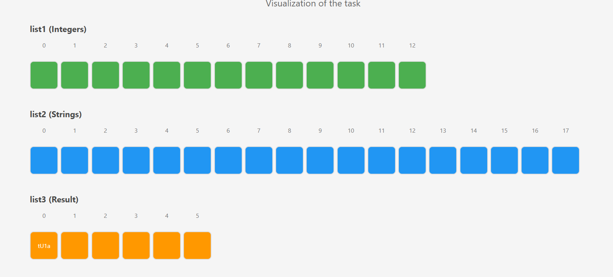

###Overview###

This Java program demonstrates list manipulation by transforming integer values into strings using a mathematical formula, then systematically deleting elements from formula applied list.
Algorithm Steps

Step 1: Data Initialization
The program creates two lists:

Integer list (list1): [7, 9, 7, 5, 6, 8, 6, 8, 5, 3, 5, 9, 3]

String list (list2): ["CzD", "zSz34", "MTF6", "Th14Q", "1nY", "HQC", "NqckV", "YEC1", "WsR", "jgtQ", "P8r", "fd00", "eYR5", "VlITy", "pqi", "FWS", "oE7", "tU1a"]

Step 2: Formula Application

For each integer in list1, the program calculates: index = value × 2 - 1
Transformation examples:

Position 0: Value 7 → Index 13(2 * 7-1) → String "VlITy"

Position 1: Value 9 → Index 17(2 * 9-1) → String "tU1a"

Position 2: Value 7 → Index 13(2 * 7-1) → String "VlITy"

Position 3: Value 5 → Index 9(2 * 5-1) → String "jgtQ"

This creates a result list: ["VlITy", "tU1a", "VlITy", "jgtQ", "P8r", "eYR5", "P8r", "eYR5", "jgtQ", "MTF6", "jgtQ", "tU1a", "MTF6"]

Step 3: Element Deletion Process
The program calculates how many elements to remove:

###Formula###:

Math.ceil(initialList1Size / 2.0)

For 13 elements: Math.ceil(13 / 2.0) = Math.ceil(6.5) = 7

#####Critical deletion behavior#####: 

The program removes elements using a fixed index approach in a loop:
it's deletion starts from string indexed 0 and next one is string indexed 1, however, string indexed 1 now is string indexed 2 from original formula applied list.

for (int i = 0; i < numberOfElementsToRemove; i++) {
list1.remove(i);
resultList.remove(i);
}

This means it removes elements at positions: 0, 1, 2, 3, 4, 5, 6 from the original positions, but since the list shrinks after each removal, it actually removes elements in a specific pattern.

